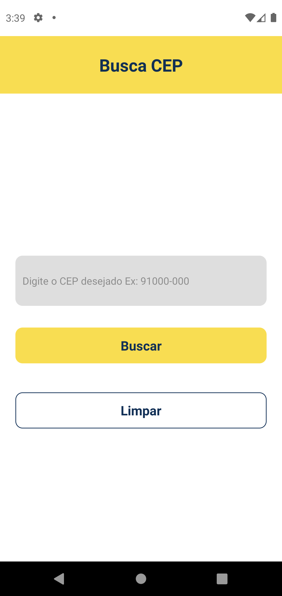

<h1 align="center"> App Busca cep, para utilização da API Via Cep</h1>

#Índice
- [➡️ Demo](#️-demo)
- [➡️ Sobre o projeto](#️-sobre-o-projeto)
- [🚀 Tecnologias utilizadas neste projeto](#-tecnologias-utilizadas-neste-projeto)
  - [- [x] Async Await](#--x-async-await)
- [📥 Como usar](#-como-usar)
- [🚀 Autor](#-autor)

---

# ➡️ Demo
Link do projeto em funcionamento:  = https://snack.expo.dev/@tayse_rosa/github.com-tayserosa-buscacep

<p align="center">

</p>

---

# ➡️ Sobre o projeto
O projeto foi desenvolvido para treinar habilidades de desenvolvimento como por exemplo busca de dados em uma API atraves do React Native.

Neste projeto foi desenvolvido um App para consumir a API Via Cep (https://viacep.com.br/).

---

# 🚀 Tecnologias utilizadas neste projeto
O projeto foi desenvolvido utilizando as seguintes tecnologias:

- [x] Expo
- [x] Javascript
- [x] Styled Components
- [x] Navigation Container
- [x] useState
- [x] Async Await
---

# 📥 Como usar
```js

    //Clonar o repositório
    $ git clone https://github.com/TayseRosa/BuscaCep.git

    //Entrar no diretório
    $ cd BuscaCep

    //Instalar as dependências do projeto
    $ npm install

    //Startar o projeto
    $ expo start

``` 

---
# 🚀 Autor

<a href="https://www.tayserosa.dev">
 
 <br />
 <sub><b>www.tayserosa.dev</b></sub></a> <a href="https://www.tayserosa.dev" title="Tayse Rosa" target="_blank">🚀</a>


Feito com ❤️ por Tayse Rosa 🚀

👋🏽 Entre em contato!

[](https://github.com/TayseRosa/)
